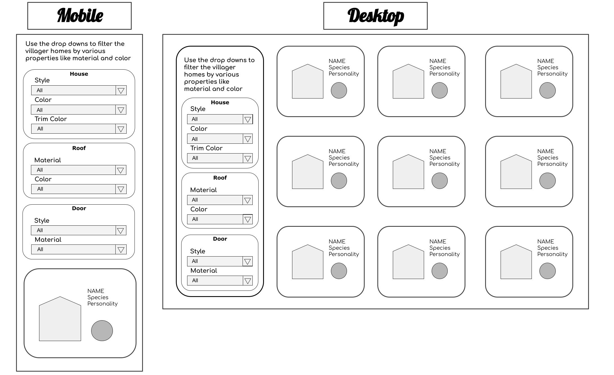

# Villager Homes
### Author
[Lydia Minehan-Tubic](https://github.com/LydiaMT)

### Problem Domain

The Animal Crossing fandom is huge! While there are plenty of public resources available to players across the world wide web, it can be difficult to find information on villager home exteriors. Many ACNH players enjoy picking themes for their islands. Villager homes have a wide variety of aesthetics from color, to material, to architecture. These styles can be key to bringing your island theme to life!

My goal with this website is to provide an intuitive user experience where users can narrow down villagers' homes by desired features through filtered form dropdowns. 

### User Stories

*As a user, I want to be able to pick villagers for my island by their home exteriors so the houses match the theme or aesthetic of my island.*

### Initial Wire Frame



### Deploy to git pages

First compile the app by running build:

```git
npm run build
```

Then, deploy to git pages:

```git
git subtree push --prefix build origin gh-pages
```

### Sources
* [Villager House Exterior Designs Complete List](https://animalcrossingworld.com/guides/new-horizons/villager-house-exterior-designs-complete-list/): Huge shout out to Animal Crossing World for the house exterior artwork and information.
* [Convert Data Between CSV And JSON With Simple JavaScript](https://www.youtube.com/watch?v=hMwKfkaCdJU)
* [How to Download a file with node.js](https://stackoverflow.com/questions/11944932/how-to-download-a-file-with-node-js-without-using-third-party-libraries)
* [Node JS get file name from absolute path](https://stackoverflow.com/questions/19811541/nodejs-get-file-name-from-absolute-path)
* [How to use Checkbox inside Select Option](https://stackoverflow.com/questions/17714705/how-to-use-checkbox-inside-select-option)